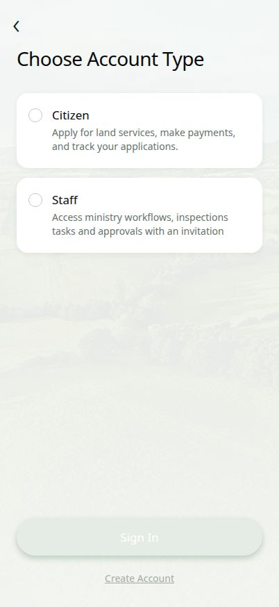
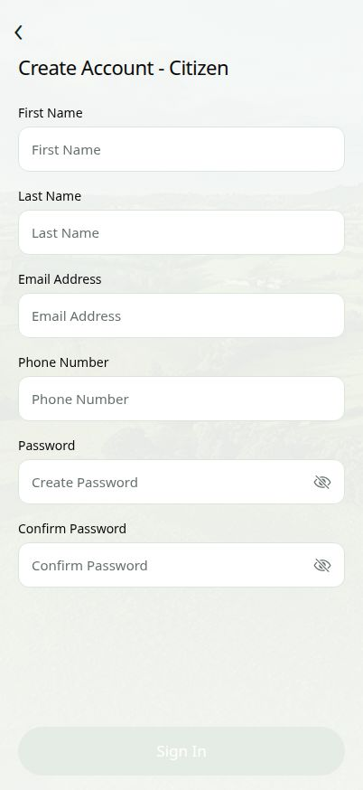
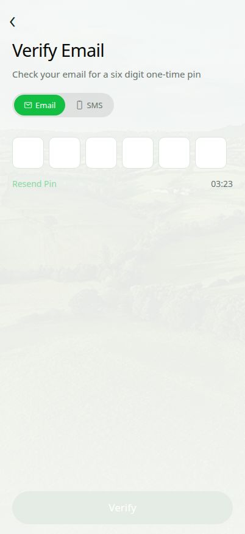
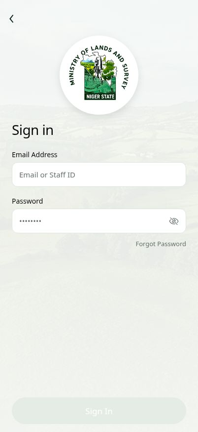
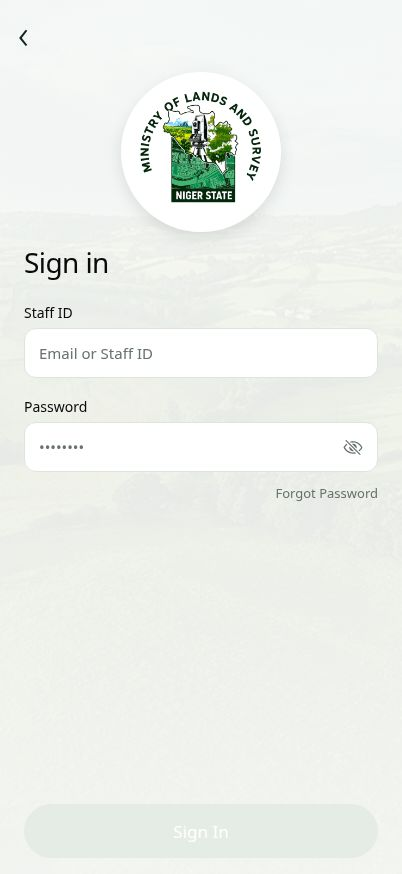

# NGS Land Surveys

Official mobile application for the Niger State Ministry of Lands & Survey — Minna, Nigeria.

Built with Expo (React Native), Expo Router, and TypeScript.

---

## Screenshots

### Onboarding

| Splash Screen | Account Type |
|:---:|:---:|
|  |  |

### Auth Flow

| Create Account | Verify OTP | Sign In (Citizen) | Sign In (Staff) |
|:---:|:---:|:---:|:---:|
|  |  |  |  |

---

## Features

### Citizen Portal

| Screen | Description |
|---|---|
| Home | Application summary cards, quick-pay shortcuts, ministry announcements, and a ChatBot assistant |
| Services | Searchable grid covering C-of-O, Survey Plan, Deed of Assignment, Excision, Regularisation, and more |
| Applications | Full tracker with inline detail view; Awaiting Payment status launches the Remita payment modal |
| Inbox | Ministry-to-citizen messages with read/unread indicators |
| Profile | Personal Info, Change Password, Notifications, Privacy & Security, Help & Support, Terms, About |

### Staff Portal

| Screen | Description |
|---|---|
| Work Summary | Daily KPIs — tasks due, inspections pending, applications awaiting review |
| Tasks | Searchable task list with priority badges and due-date tags |
| Inspections | Scheduled site visits with a hybrid satellite map modal at each parcel location |
| Applications | Review queue with per-item approve/reject checklist, observation notes, file upload, and map |
| Profile | Same as Citizen profile plus Staff ID and Department sections |

### Auth Flow

**Create Account (Citizen)**
- First Name, Last Name, Email Address, Phone Number
- Password and Confirm Password with eye-toggle on each field
- Submits to OTP verification

**OTP Verification**
- Six-box one-time pin with auto-advance between boxes
- Email / SMS channel toggle
- Sixty-second countdown with Resend Pin when expired
- Verify button activates only when all six digits are entered

**Sign In**
- Email or Staff ID field plus password with eye-toggle
- Forgot Password link
- Fingerprint login button — auto-prompts Touch ID / Face ID 700 ms after the screen loads
- Pulsing green concentric rings with a white fingerprint icon
- Re-triggers on tap; falls back gracefully when biometric is not enrolled

### Payment

Remita payment modal with four channels: Card, Bank Transfer, USSD, and Direct Debit. Includes the official Remita logo, a simulated processing animation, and a receipt view.

### ChatBot

Ministry-logo floating action button on all citizen screens. Opens a chat modal with five quick-reply shortcuts, typed Q&A responses, a typing indicator, and the ministry seal as the bot avatar.

---

## Project Structure

```
app/
  _layout.tsx                 Root Stack with Inter font loading
  index.tsx                   Splash (12 s) then Welcome screen
  auth/
    account-type.tsx          Citizen / Staff radio picker
    sign-in.tsx               Password login + auto biometric prompt
    create-citizen.tsx        Citizen registration form
    verify-otp.tsx            Six-box OTP, countdown, Email/SMS toggle
  citizen/
    index.tsx                 Home dashboard
    services.tsx              Services search and grid
    applications.tsx          Application tracker and Remita modal
    inbox.tsx                 Ministry messages
    profile.tsx               Settings with seven sections
  staff/
    index.tsx                 Work summary dashboard
    tasks.tsx                 Task list
    inspections.tsx           Inspections with satellite map
    applications.tsx          Application review checklist
    profile.tsx               Settings with eight sections

components/
  AvatarPicker.tsx            SVG human avatar with camera action sheet
  ChatBotFAB.tsx              Floating chat button and modal
  FigmaTabBar.tsx             Custom bottom tab bar
  MapModal.tsx                Native satellite map
  MapModal.web.tsx            Web stub
  RemitaPaymentModal.tsx      Four-channel Remita payment flow
  KeyboardAwareScrollViewCompat.tsx

constants/
  colors.ts                   Design tokens

hooks/
  useColors.ts                Token resolver

assets/
  fonts/                      Inter 400, 500, 600, 700
  images/brand/               Seals, logos, landscape background
  screenshots/                App screen captures
```

---

## Design Tokens

| Token | Value |
|---|---|
| Primary | #13bf43 |
| Background | #f7faf7 |
| Card | #ffffff |
| Text | #0a0a0a |
| Muted foreground | #66726b |

The tab bar highlights the active tab with a 56 x 56 green rounded square. Every main screen uses a green pill for the page title and a green circle bell button in the header. Avatars are gender-aware SVG illustrations that can be replaced with a camera photo.

---

## Dependencies

| Package | Purpose |
|---|---|
| expo ~53 | Core SDK |
| expo-router | File-based navigation |
| expo-local-authentication | Touch ID and Face ID login |
| expo-image-picker | Profile photo from camera or gallery |
| expo-haptics | Tactile feedback |
| expo-linear-gradient | Background washes |
| react-native-maps | Satellite map for inspections |
| react-native-svg | SVG avatar illustrations |
| @expo/vector-icons | Ionicons |
| expo-font | Inter font loading |
| react-native-safe-area-context | Edge-to-edge layout |

---

## Getting Started

```bash
pnpm install
pnpm run dev
```

Scan the QR code with Expo Go on Android or the Camera app on iOS.

```bash
pnpm run typecheck
```

---

## Test Credentials

| Role | Identifier | Password |
|---|---|---|
| Citizen | sagiru@gmail.com | any non-empty value |
| Staff | zaguru@mls.gov.ng or MLS-STAFF-00124 | any non-empty value |

Authentication is simulated. Any non-empty credentials navigate to the portal. Biometric success navigates directly without a password.

---

## Roadmap

| Feature | Status |
|---|---|
| Remita live API keys | Pending |
| Google Maps API key for iOS production | Pending |
| Real backend and REST API | Pending |
| Push notifications | Planned |
| Dark mode | Planned |

---

Organisation: Niger State Ministry of Lands & Survey, Minna, Niger State, Nigeria
